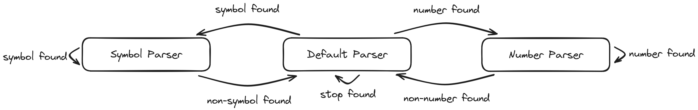
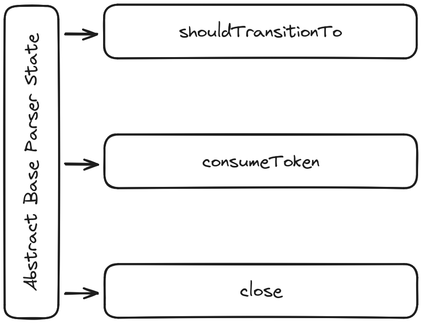
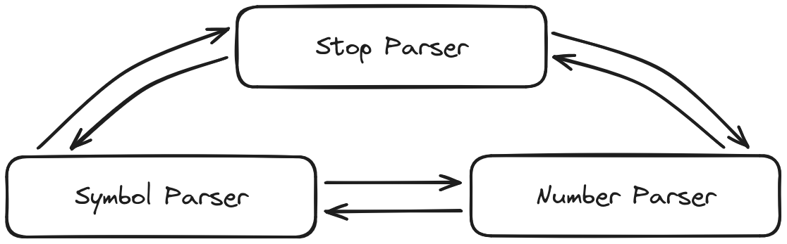

# Day 3

Day 3 asks that we find all numbers which are "adjacent" to a symbol.

```text
467..114..
...*......
..35..633.
......#...
617*......
..........
```

One way to solve this is to treat the numbers and symbols as rectangles and
check for any intersections. This can be visualized like so:


To determine intersections between rectangles, lets consider the following 4
scenarios:


As indicated, if the rectangles overlap in the y-axis, the bottom edge of
rectangle two must be below the top edge of rectangle one, and the bottom edge
of rectangle one must be below the top edge of rectangle two.

The following diagram expresses this mathematically:


Since the input corresponds to a regular (Type-3) grammar in the Chomsky hierarchy, it can be parsed with a finite state machine (FSM). An FSM with 3 states was implemented, as shown in the below diagram.



It may not have escaped the attentive reader, the fact that this is somewhat more complex than it needs to be for the task at hand. We'll discuss why later and how we can simplify it.

The default parser state, is responsible for parsing stops ("."). In practice, this simply means advancing one token. If it encounters a number or a symbol, it defers control to the number and symbol parsers respectively.

The number parser parses numbers. These can be of any length but may not wrap onto a new line. Side note, the latter rule is not actually specified in the description of the challenge but was assumed and yielded the correct answers. Since numbers can have an arbitrary length, the parser needs to track the position of the first token it encounters. When a non-number token is encountered, it will generate a number node in the AST (the AST is by definition a list because we're parsing a regular language). The number node encodes the rectangle which contains the number, and the value of the number. After generating the number node, it transitions back to the default parser state, without advancing a token.

The symbol parser state is somewhat simpler, since symbols have a maximum length of one. Therefore, whenever we transition to the symbol parser state, we generate a symbol node, advance one token, and then transition to the default parser state. The symbol node consists of the rectangle containing the symbol, expanded one square in each direction, and the value of the symbol (e.g. "#").

This implementation of the FSM is slightly messy for several reasons. For example, in practice, the symbol parser state may transition to the default parser state, only for the default parser to transition back to the symbol parser state without advancing. This will happen when there are two or more consecutive symbol tokens. A similar fate befalls the number parser when it crosses onto the next line.

I don't plan to change the implementation, but if I did want to improve upon it, I would first separate the logic for consuming a token, emitting an AST node, and determining which state should consume a given token. I would also remove the responsibility of advancing a token from the state to the FSM engine. For the record, the engine is what I'm calling the root parser class which controls the FSM. It doesn't need to exist but I think it makes the code more readable than implementing its functionality in the abstract state base class. It also means that the AST and position don't need to be passed from state to state during transitions.

These logic for consuming tokens, emitting AST nodes, and determining which state to transition to can be separated into discrete methods, as shown below.



In the above diagram, the `shouldTransitionTo` method is called first in each cycle of the FSM. It determines if a state transition should occur, and, if so, to which state. Note that a state can transition to itself (e.g. the symbol parser state would do this if it encountered consecutive symbols). If a state transition should occur, the `close` method is then called on the current state. This is where the state should emit an AST node (if required). Next, the new state (if any) is assumed. Lastly, the `consumeToken` method is called on the new (or current if no transition occurred) state.

As shown in the below diagram, the next state doesn't actually influence the previous state.



Therefore, the logic for determining the next state (i.e. the `shouldTransitionTo` method) can be elevated from the implementation of each state to the engine of the FSM, reducing code duplication.
