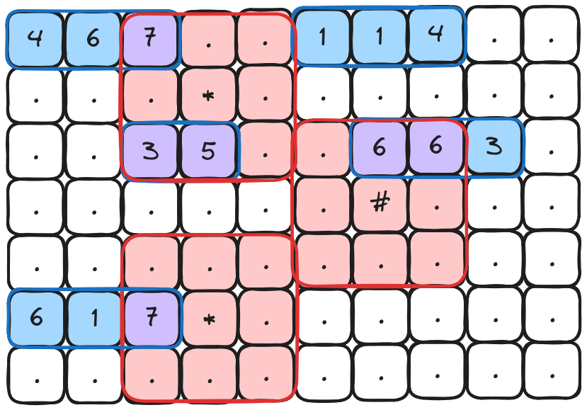
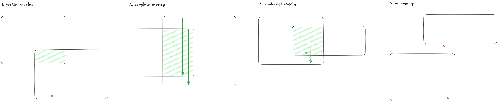
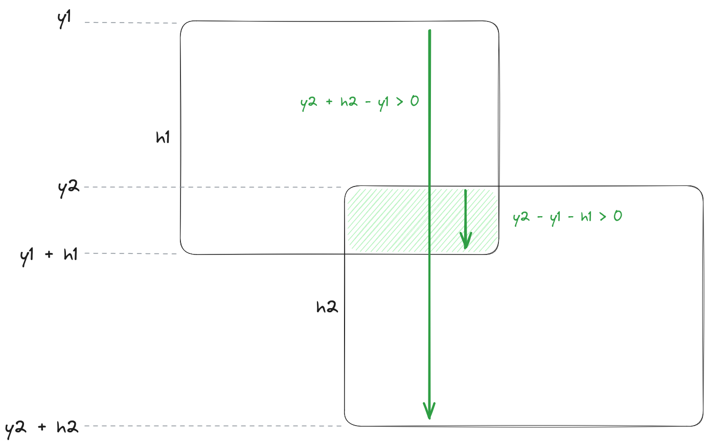

# Day 3

Day 3 asks that we find all numbers which are "adjacent" to a symbol.

```text
467..114..
...*......
..35..633.
......#...
617*......
..........
```

One way to solve this is to treat the numbers and symbols as rectangles and
check for any intersections. This can be visualized like so:



To determine intersections between rectangles, lets consider the following 4
scenarios:



As indicated, if the rectangles overlap in the y-axis, the bottom edge of
rectangle two must be below the top edge of rectangle one, and the bottom edge
of rectangle one must be below the top edge of rectangle two.

The following diagram expresses this mathematically:


